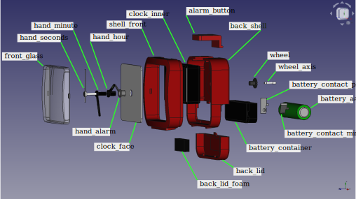
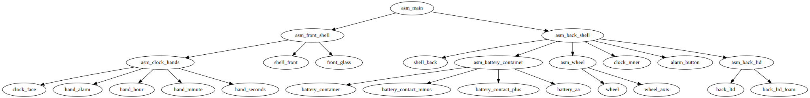

# FreeCAD alarm clock
This is a FreeCAD project modeling an alarm clock. I have a real alarm clock
on my desk and reproduced it in FreeCAD as an exercise.

Project manifest:
* The FreeCAD files in `/parts`. The top-level assembly is `asm_main.FCStd`.
* An exploded view of the labeled parts.
* The assembly graph with all parts and assemblies.
* Thumbnail views for all the parts and assemblies.
* Photographs of the real alarm clock for reference.

Thumbnails and photographs are included as part of a separate downloadable data
release.

## Parts diagram
The following diagram lists all the parts on an exploded view.

The parts are grouped by assemblies according to the following diagram

## Animating
The animation of assemblies for the purpose of producing exploded views is
controlled by the variable `explode` in the file `master_animator`.

## Software
I used FreeCAD 0.19.4 for Void Linux 64bits.
The assemblies are made using
[Assembly4](https://github.com/Zolko-123/FreeCAD_Assembly4).

## Limitations
This is my first FreeCAD project, and among my first CAD projects. As such
there are doubtlessly some awkward choices in the design.

* There are warnings that I do not know how to resolve about out-of-scope links.
* Overall I am happy with the design of parts, which is made with sketches in
  the PartDesign workbench. There may be beginner mistakes.
